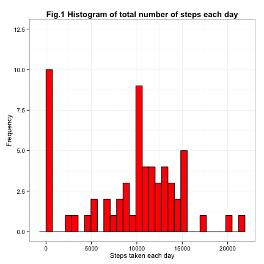
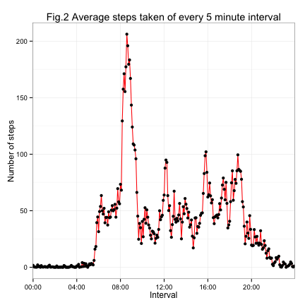
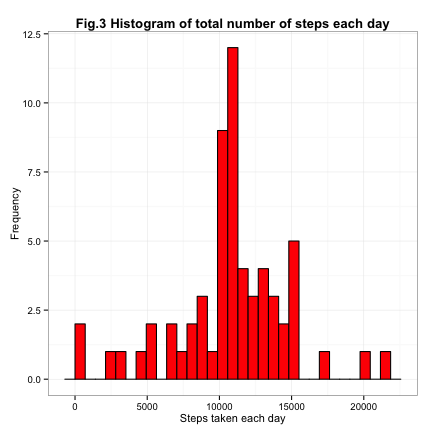
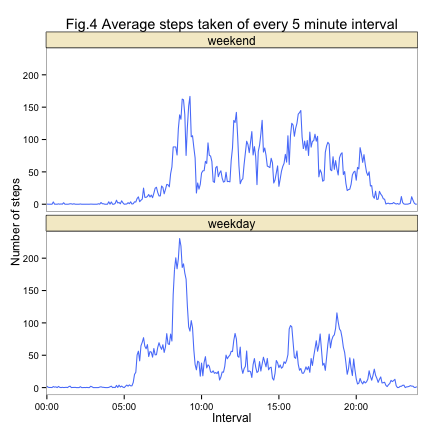

================================================================================ 

## Title: Reproducible Research: Peer Assessment 1 
output:   
  html_document:  
    keep_md: true  
    
================================================================================    

setwd("set your working directory here")

## Loading and preprocessing the data

#### *1. Load the data*

```r
if (!file.exists("activity.csv")) { 
        unzip(actvity.zip) 
}

activity<-read.csv("activity.csv", header=TRUE)
# check the first 5 rows in the data sheet
head(activity)
```

```
##   steps       date interval
## 1    NA 2012-10-01        0
## 2    NA 2012-10-01        5
## 3    NA 2012-10-01       10
## 4    NA 2012-10-01       15
## 5    NA 2012-10-01       20
## 6    NA 2012-10-01       25
```

```r
# check the class for each column in the dataset
sapply(activity,class)
```

```
##     steps      date  interval 
## "integer"  "factor" "integer"
```

#### *2. Process data into the format suitable for analysis*


```r
# change the date from factor class as DATE class
activity$date<-as.Date(as.character(activity$date),"%Y-%m-%d")
newDF <- data.frame(year = as.numeric(format(activity$date, format = "%Y")),
                   month = as.numeric(format(activity$date, format = "%m")),
                   day = as.numeric(format(activity$date, format = "%d")))
activityDF<-cbind(activity,newDF)

# Convert the interval column from integer to time HH:MM
activityDF$interval<-sprintf("%04d",activityDF$interval)
activityDF$interval<-format(strptime(activityDF$interval,format="%H%M"),format="%H:%M")
head(activityDF)
```

```
##   steps       date interval year month day
## 1    NA 2012-10-01    00:00 2012    10   1
## 2    NA 2012-10-01    00:05 2012    10   1
## 3    NA 2012-10-01    00:10 2012    10   1
## 4    NA 2012-10-01    00:15 2012    10   1
## 5    NA 2012-10-01    00:20 2012    10   1
## 6    NA 2012-10-01    00:25 2012    10   1
```

## What is mean total number of steps taken per day?

#### *1. Calculate the total number of steps taken per day*


```r
require(dplyr)
require(ggplot2)
# calcualte the total nubmers of steps taken each day
DFbyDay<-activityDF%>%
        group_by(date)%>%
        summarise(total.steps=sum(steps,na.rm=TRUE))

# please note you can also the aggregate() to do the same (see code below)
# DFbyDay<-aggregate(activityDF$steps,by=list(activity$date),sum,na.rm=TRUE)
```

#### *2. make a historgram of the total number of steps taken each day*
**Please note: because there are full days with missing values (NAs), the aggregate() and dplyr's summarise() did not ingore the NAs, therefore it reports 0 for those days with NAs. Therefore you will see the big spike in the histogram at x-axis (~0:00). This is due to the 0 reported (instead of NAs). Please also note: that I have made the y scales for two histograms (this one and figure 3) at the same scale for the comparison purpose**


```r
ggplot(DFbyDay, aes(x=total.steps))+
        geom_histogram(bindwidth=diff(range(DFbyDay$total.steps))/30, 
                       fill="red",color="black")+
        labs(x="Steps taken each day", y="Frequency")+
        scale_y_continuous(limits=c(0, 12.5),breaks=c(0,2.5,5,7.5,10,12.5))+
        ggtitle("Fig.1 Histogram of total number of steps each day")+
        theme_bw()+
        theme(axis.title=element_text(size=11))+
        theme(plot.title = element_text(size = rel(1.1),face="bold"))
```



#### *3. Calculate and report the mean and median number of total steps taken each day*
**Please note: we are asked to calucate the mean and median of the total numbers of steps taken over all the days in the dataset ingoring the missing valeus. To be clear, when using aggregate() or dplyr's summarise(), the sum for a day was reported as 0 (Not NA) if all values for that day were missing. So the subsequent mean and median of total steps per day is incorrect. Therefore, for these days which have total 0 number of steps should be removed before the caculation of the mean and median steps.** 


```r
summaryDF<-filter(DFbyDay, total.steps!=0)
a<-mean(summaryDF$total.steps,na.rm=TRUE)
b<-median(summaryDF$total.steps,na.rm=TRUE)
MMreport<-data.frame("mean,steps"=a,"median.steps"=b)
MMreport   
```

```
##   mean.steps median.steps
## 1   10766.19        10765
```


## What is the average daily activity pattern?

#### *1. make a time series plot of the 5-minute interval (x-axis) and the average number of steps taken, average across all days(y-axis)*


```r
# cacluate the average number of steps taken across all days
intervalDF<-activityDF%>%
           group_by(interval)%>%
           summarise(meanStep=mean(steps,na.rm=TRUE))

# make a time series plot

ggplot(intervalDF,aes(x=interval,y=meanStep))+
        geom_line(aes(group=1), color="red")+
        geom_point()+
        ggtitle("Fig.2 Average steps taken of every 5 minute interval")+
        labs(x="Interval",y="Number of steps")+
        theme_bw()+
        #theme(axis.text.x=element_blank())+
        scale_x_discrete(name="Interval",
                         breaks=c("00:00","04:00","08:00","12:00","16:00","20:00","24:00"))       
```



#### *2. Which 5-minute interval, on average across all the days in the dataset, contains the  maximum number of steps?*


```r
intervalDF[which.max(intervalDF$meanStep),]
```

```
## Source: local data frame [1 x 2]
## 
##   interval meanStep
## 1    08:35 206.1698
```

#### *3. Conclusion: From above: 08:35 time interval contains the maximum number of steps 206 steps)*


## Imputing missing values

#### *1. Calculate and report the total number of missing values in column "steps"*


```r
sum(is.na(activity$steps))
```

```
## [1] 2304
```

```r
# Therefore the total rows of missing values (s) are 2304
```

#### *2. Devise a strategy for filling in all the missing values in the dataset*

**After reading the Course Disucssion Forum thread "Imputation", I decided to substitute the NAs of each 5-min interval with the correponding interval mean caculated (in part 3), because the 5-min interval mean is the very representative. For example, I think that it is more appropriate to fill in 0 steps for 01:55 time interval, rather than the mean steps taken per day.** 


```r
# derive the weekday for the data and add a new column into the orginal data
activityDF$weekdays<-weekdays(activityDF$date)

#subset all the NA data
NaDF<-activityDF[is.na(activityDF$steps),]

# check which weekdays are missing values and how many of them are missing. This result #below suggests that except for Tuesday, every other weekday has missing values. Among #them, two Fridays (2x288=576) and two Mondays (2x288=576) were missing.

table(NaDF$weekdays)
```

```
## 
##    Friday    Monday  Saturday    Sunday  Thursday Wednesday 
##       576       576       288       288       288       288
```

```r
# merge the NA data frame (NaDF) with intervalDF
mergedDF<-merge(NaDF,intervalDF,by="interval")

# now re-arrange the data by date and the intervals in an ascending order
rearrangedDF<-mergedDF%>%
        group_by(date)%>%
        arrange(interval)
head(rearrangedDF)
```

```
## Source: local data frame [6 x 8]
## Groups: date
## 
##   interval steps       date year month day weekdays  meanStep
## 1    00:00    NA 2012-10-01 2012    10   1   Monday 1.7169811
## 2    00:05    NA 2012-10-01 2012    10   1   Monday 0.3396226
## 3    00:10    NA 2012-10-01 2012    10   1   Monday 0.1320755
## 4    00:15    NA 2012-10-01 2012    10   1   Monday 0.1509434
## 5    00:20    NA 2012-10-01 2012    10   1   Monday 0.0754717
## 6    00:25    NA 2012-10-01 2012    10   1   Monday 2.0943396
```

```r
#organize the reagrranged data by arranging columns orders as those in activityDF data

imputedDF<-rearrangedDF%>%
         select(meanStep,date,interval,year,month,day,weekdays)%>%
         rename(steps=meanStep)
head(imputedDF)
```

```
## Source: local data frame [6 x 7]
## Groups: date
## 
##       steps       date interval year month day weekdays
## 1 1.7169811 2012-10-01    00:00 2012    10   1   Monday
## 2 0.3396226 2012-10-01    00:05 2012    10   1   Monday
## 3 0.1320755 2012-10-01    00:10 2012    10   1   Monday
## 4 0.1509434 2012-10-01    00:15 2012    10   1   Monday
## 5 0.0754717 2012-10-01    00:20 2012    10   1   Monday
## 6 2.0943396 2012-10-01    00:25 2012    10   1   Monday
```

```r
# subset non-NA data from activityDF
nonNaDF<-filter(activityDF,steps!="NA")

# merged the NA imputed data (imputedDF) and non-NA data (nonNaDF)
finalDF<-rbind(imputedDF,nonNaDF)

# arrange the finalDF by date and intervals
finalDF<-finalDF%>%
        group_by(date)%>%
        arrange(interval)
```

#### *3. Create a new dataset that is equal to the orignal data but with the missing values filled in*


```r
#please note, here only three columns are in the data frame, as the original data 'activity' 
finalDF2<-finalDF%>%
        select(steps,date,interval)
head(finalDF2) # this finalDF2 is exactly like the orignal data 'activty' but with filled missing values
```

```
## Source: local data frame [6 x 3]
## Groups: date
## 
##       steps       date interval
## 1 1.7169811 2012-10-01    00:00
## 2 0.3396226 2012-10-01    00:05
## 3 0.1320755 2012-10-01    00:10
## 4 0.1509434 2012-10-01    00:15
## 5 0.0754717 2012-10-01    00:20
## 6 2.0943396 2012-10-01    00:25
```

#### *4.1 Make a histogram of the total number of steps taken each day (now using the imputed data set*


```r
DFbyDay2<-finalDF2%>%
        group_by(date)%>%
        summarise(total.steps=sum(steps,na.rm=TRUE))

# make a historgram

ggplot(DFbyDay2, aes(x=total.steps))+
        geom_histogram(bindwidth=diff(range(DFbyDay2$total.steps))/30, 
                       fill="red",color="black")+
        labs(x="Steps taken each day", y="Frequency")+
        ggtitle("Fig.3 Histogram of total number of steps each day")+
        theme_bw()+
        theme(axis.title=element_text(size=11))+
        theme(plot.title = element_text(size = rel(1.1),face="bold"))
```



#### *4.2 Calculate and report the mean and median total number of steps taken per day. Do these values differ from the estimates from the first part of the assignment? What is the impact of imputing missing data on the estimates of the total daily number of steps?*


```r
# Calculate and report the mean and median total number of steps taken per day
a2<-mean(DFbyDay2$total.steps)
b2<-median(DFbyDay2$total.steps)
MMreport2<-data.frame("mean,steps"=a2,"median.steps"=b2)   

# Compare the current mean and median with the previous mean and median (calcuated in first part of assignment)
comparisonDF<-rbind(MMreport2,MMreport)
comparisonDF$note<-c("filled.NA","not.filled.NA")  # add the column to comparisonDF

comparisonDF
```

```
##   mean.steps median.steps          note
## 1   10766.19     10766.19     filled.NA
## 2   10766.19     10765.00 not.filled.NA
```

#### *4.3 Interpreting the data and conclusion: Do these values differ from the estimates from the first part of the assignment? What is the impact of imputing missing data on the estimates of the total daily number of steps?*   

**By using my strategy of filling the missing values, we can see there is almost no difference for the median and the mean from the filled and not filled data. Therefore, the imputation of the missing data in this case did not really affect the total daily number of steps. However, the difference may occur depending on which strategy you use for filling in all missing values.**


## Are there differences in activity patterns between weekdays and weekends?

#### *1. Create a new factor variable in dataset with two levels--"weekday" and "weekend" indicating whether a given data is a weekday or weekend day*


```r
#creat a vector of weekdays
wdays<-c("Monday", "Tuesday", "Wednesday", "Thursday", "Friday")

# Use %in% and 'wdays' to creat a logic vector 
# and then convert it to factor and specify the 'level and labels'

finalDF$workingDay<-factor(finalDF$weekdays %in% wdays,
                           levels=c(FALSE,TRUE),
                           labels=c("weekend","weekday"))
head(finalDF)
```

```
## Source: local data frame [6 x 8]
## Groups: date
## 
##       steps       date interval year month day weekdays workingDay
## 1 1.7169811 2012-10-01    00:00 2012    10   1   Monday    weekday
## 2 0.3396226 2012-10-01    00:05 2012    10   1   Monday    weekday
## 3 0.1320755 2012-10-01    00:10 2012    10   1   Monday    weekday
## 4 0.1509434 2012-10-01    00:15 2012    10   1   Monday    weekday
## 5 0.0754717 2012-10-01    00:20 2012    10   1   Monday    weekday
## 6 2.0943396 2012-10-01    00:25 2012    10   1   Monday    weekday
```

#### *2. make a panel plot containing a time series plot (i.e. type="l") of the 5min interval and the average number of step taken, averaged across all weekday or weekend days (y-axis)* 


```r
intervalDF2<-finalDF%>%
           group_by(workingDay,interval)%>%
           summarise(meanStep=mean(steps,na.rm=TRUE))
```


```r
# make the plot

ggplot(intervalDF2,aes(x=interval,y=meanStep))+
        geom_line(aes(group=1), color="#5882FA")+
        facet_wrap(~workingDay,nrow=2)+
        ggtitle("Fig.4 Average steps taken of every 5 minute interval")+
        labs(x="Interval",y="Number of steps", size =12)+
        theme_bw()+
        theme(panel.grid.major=element_blank(),panel.grid.minor=element_blank())+
        scale_x_discrete(name="Interval",
                         breaks=c("00:00","05:00","10:00","15:00","20:00","25:00"))+
        theme(strip.background=element_rect(fill="#F5ECCE",colour="black",size=0.3), strip.text.x=element_text(size=12))
```


  
#### *3. Interpreting the data: Are there differences in activity patterns between weekdays and weekends?*

**Yes, there are clear patterns between weekdays and weekends. From the panel plot, we can clearly see that although the overall acitivity on the weekends has increased from 10:00 to 24:00, the activity between 05:00 and 10:00 on the weekends is lower that those on the weekdays. This fits to our general habit--that is, we rest more in the mornig (sleep in) during the weekend, and more active during the weekdays (because we have to go to work).**
